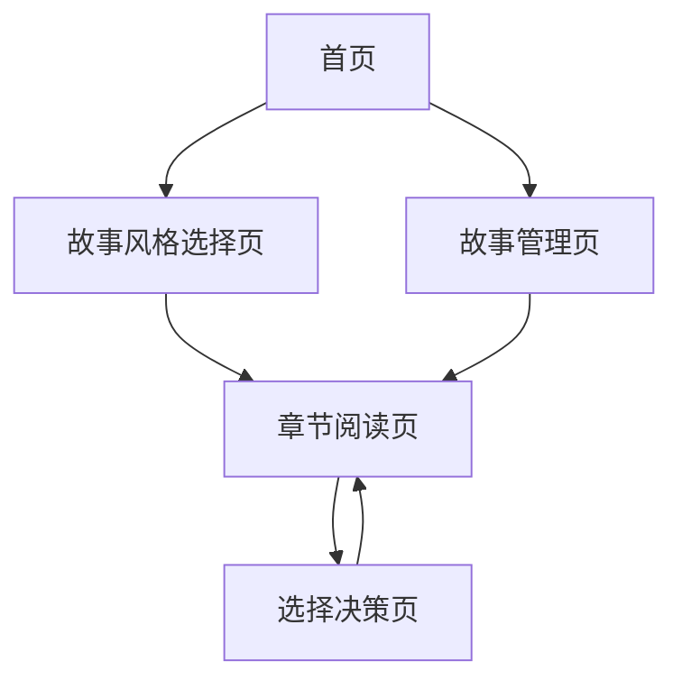

## 1. Product Overview
AI交互式小说是一个基于人工智能的互动小说平台，用户可以选择不同的故事风格，通过AI生成的选择或自定义输入来影响故事发展。产品旨在为中国网络小说爱好者提供个性化、沉浸式的阅读体验，让每个用户都能成为故事的参与者和创造者。

## 2. Core Features

### 2.1 User Roles
由于MVP版本专注核心功能验证，暂不区分用户角色，所有用户均可访问全部功能。

### 2.2 Feature Module
我们的AI交互式小说产品包含以下核心页面：
1. **首页**：风格选择、产品介绍
2. **故事风格选择页**：三种风格展示和选择
3. **章节阅读页**：故事内容展示、阅读进度
4. **选择决策页**：AI选项展示、自定义输入
5. **故事管理页**：故事列表、进度管理

### 2.3 Page Details

| Page Name | Module Name | Feature description |
|-----------|-------------|---------------------|
| 首页 | 产品介绍 | 展示产品特色、开始新故事入口 |
| 首页 | 导航菜单 | 页面导航、故事管理入口 |
| 故事风格选择页 | 风格展示 | 展示修仙、武侠、科技三种风格，包含风格描述和预览 |
| 故事风格选择页 | 风格选择 | 用户选择喜欢的故事风格，开始新故事 |
| 章节阅读页 | 内容展示 | 显示当前章节内容（2000-3000字），支持滚动阅读 |
| 章节阅读页 | 进度显示 | 显示当前章节数、阅读进度条 |
| 章节阅读页 | 阅读控制 | 继续阅读按钮、返回选择按钮 |
| 选择决策页 | AI选项展示 | 显示3个AI生成的故事选择，每个选择有简短描述 |
| 选择决策页 | 自定义输入 | 提供文本输入框，允许用户自定义故事发展方向 |
| 选择决策页 | 选择确认 | 确认选择按钮、加载状态提示 |
| 故事管理页 | 故事列表 | 显示用户的所有故事，包含标题、风格、进度 |
| 故事管理页 | 故事操作 | 继续阅读、重新开始、删除故事功能 |

## 3. Core Process

用户首先访问首页了解产品，然后进入故事风格选择页面选择喜欢的风格（修仙、武侠或科技）。选择风格后，AI生成第一章内容，用户在章节阅读页阅读。阅读完成后进入选择决策页，可以从3个AI选项中选择或输入自定义内容来影响故事发展。基于用户选择，AI生成下一章内容，循环此过程。用户可以在故事管理页查看和管理多个故事。

## 4. User Interface Design

### 4.1 Design Style
- **主色调**：深蓝色(#1a365d)和金色(#d69e2e)，营造古典文学氛围
- **辅助色**：浅灰色(#f7fafc)背景，深灰色(#2d3748)文字
- **按钮样式**：圆角矩形，渐变效果，悬停时有阴影
- **字体**：中文使用思源黑体，英文使用Inter，正文16px，标题24px
- **布局风格**：卡片式设计，顶部导航，响应式布局
- **图标风格**：线性图标，简洁现代

### 4.2 Page Design Overview

| Page Name | Module Name | UI Elements |
|-----------|-------------|-------------|
| 首页 | 产品介绍 | 大标题、副标题、特色介绍卡片、开始按钮(金色渐变) |
| 首页 | 导航菜单 | 顶部导航栏，Logo、菜单项、用户入口 |
| 故事风格选择页 | 风格展示 | 三个风格卡片，每个包含图标、标题、描述、预览文本 |
| 故事风格选择页 | 风格选择 | 卡片悬停效果、选择按钮、确认对话框 |
| 章节阅读页 | 内容展示 | 白色背景内容区域，合适的行距和字间距，滚动条 |
| 章节阅读页 | 进度显示 | 顶部进度条、章节标题、页面指示器 |
| 选择决策页 | AI选项展示 | 三个选择卡片，编号、内容预览、选择按钮 |
| 选择决策页 | 自定义输入 | 文本域、字数统计、提交按钮、输入提示 |
| 故事管理页 | 故事列表 | 表格或卡片列表，故事封面、标题、进度条、操作按钮 |

### 4.3 Responsiveness
产品采用桌面优先设计，同时适配移动端。在移动设备上，导航菜单折叠为汉堡菜单，卡片布局调整为单列，文字大小适当增加。支持触摸操作，包括滑动翻页和点击选择。