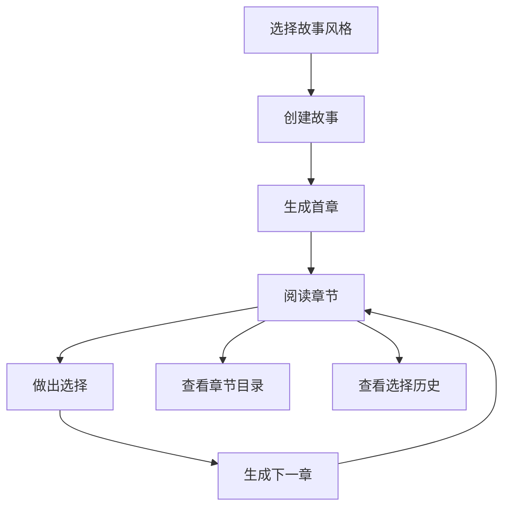

# AI交互式小说后端API需求文档

## 1. 产品概述
AI交互式小说后端API系统，为前端提供故事生成、用户选择处理、故事状态管理等核心功能。集成Gemini AI模型，支持三种风格的小说生成（修仙、武侠、科技），实现用户选择驱动的动态故事发展。

## 2. 核心功能

### 2.1 用户角色
| 角色 | 注册方式 | 核心权限 |
|------|----------|----------|
| 默认用户 | 无需注册 | 可创建故事、阅读章节、做出选择 |

### 2.2 功能模块
后端API系统包含以下核心模块：
1. **故事管理API**：故事创建、状态管理、进度追踪
2. **章节生成API**：AI驱动的章节内容生成
3. **选择处理API**：用户选择处理和下一章节生成
4. **数据存储API**：故事数据、用户选择历史存储
5. **AI集成API**：Gemini模型调用和内容生成

### 2.3 API详细规格

| API模块 | 接口名称 | 功能描述 |
|---------|----------|----------|
| 故事管理 | POST /api/stories | 创建新故事，选择风格（修仙/武侠/科技） |
| 故事管理 | GET /api/stories/{id} | 获取故事详情和当前状态 |
| 故事管理 | GET /api/stories/{id}/chapters | 获取故事章节列表 |
| 章节生成 | POST /api/stories/{id}/chapters | 生成新章节内容和选择选项 |
| 章节管理 | GET /api/chapters/{id} | 获取特定章节内容 |
| 选择处理 | POST /api/chapters/{id}/choices | 提交用户选择，触发下一章节生成 |
| 选择历史 | GET /api/stories/{id}/choices | 获取故事的选择历史记录 |
| AI生成 | POST /api/ai/generate-chapter | AI生成章节内容（内部接口） |
| AI生成 | POST /api/ai/generate-choices | AI生成选择选项（内部接口） |

## 3. 核心流程

**主要用户操作流程：**
1. 用户选择故事风格 → POST /api/stories
2. 系统生成首章内容 → POST /api/stories/{id}/chapters
3. 用户阅读章节 → GET /api/chapters/{id}
4. 用户做出选择 → POST /api/chapters/{id}/choices
5. 系统基于选择生成下一章 → POST /api/stories/{id}/chapters
6. 重复步骤3-5直到故事完成



## 4. 数据模型设计

### 4.1 核心数据表

**Stories表**
```sql
CREATE TABLE stories (
    id UUID PRIMARY KEY,
    title VARCHAR(255),
    style ENUM('修仙', '武侠', '科技'),
    status ENUM('active', 'completed', 'paused'),
    current_chapter_id UUID,
    created_at TIMESTAMP,
    updated_at TIMESTAMP
);
```

**Chapters表**
```sql
CREATE TABLE chapters (
    id UUID PRIMARY KEY,
    story_id UUID REFERENCES stories(id),
    chapter_number INTEGER,
    title VARCHAR(255),
    content TEXT,
    summary TEXT,
    created_at TIMESTAMP
);
```

**Choices表**
```sql
CREATE TABLE choices (
    id UUID PRIMARY KEY,
    chapter_id UUID REFERENCES chapters(id),
    choice_text TEXT,
    choice_type ENUM('ai_generated', 'user_custom'),
    is_selected BOOLEAN DEFAULT FALSE,
    created_at TIMESTAMP
);
```

**Story_State表**
```sql
CREATE TABLE story_state (
    id UUID PRIMARY KEY,
    story_id UUID REFERENCES stories(id),
    state_data JSONB,
    chapter_summaries JSONB,
    character_info JSONB,
    updated_at TIMESTAMP
);
```

### 4.2 API响应格式

**创建故事响应**
```json
{
    "success": true,
    "data": {
        "story_id": "uuid",
        "title": "修仙传奇",
        "style": "修仙",
        "status": "active",
        "current_chapter": 1
    }
}
```

**章节内容响应**
```json
{
    "success": true,
    "data": {
        "chapter_id": "uuid",
        "chapter_number": 1,
        "title": "初入修仙界",
        "content": "章节内容...",
        "choices": [
            {
                "id": "uuid",
                "text": "选择加入天剑宗",
                "type": "ai_generated"
            },
            {
                "id": "uuid",
                "text": "选择独自修炼",
                "type": "ai_generated"
            },
            {
                "id": "uuid",
                "text": "寻找其他门派",
                "type": "ai_generated"
            }
        ]
    }
}
```

## 5. 技术架构设计

### 5.1 技术栈选择
- **后端框架**: FastAPI (Python)
- **数据库**: PostgreSQL
- **AI模型**: Google Gemini API
- **缓存**: Redis (可选)
- **部署**: Docker + 云服务

### 5.2 项目结构
```
backend/
├── app/
│   ├── __init__.py
│   ├── main.py
│   ├── models/
│   │   ├── __init__.py
│   │   ├── story.py
│   │   ├── chapter.py
│   │   └── choice.py
│   ├── api/
│   │   ├── __init__.py
│   │   ├── stories.py
│   │   ├── chapters.py
│   │   └── choices.py
│   ├── services/
│   │   ├── __init__.py
│   │   ├── ai_service.py
│   │   ├── story_service.py
│   │   └── chapter_service.py
│   ├── database/
│   │   ├── __init__.py
│   │   ├── connection.py
│   │   └── migrations/
│   └── config/
│       ├── __init__.py
│       └── settings.py
├── tests/
├── requirements.txt
├── Dockerfile
└── README.md
```

### 5.3 AI集成方案

**Prompt模板设计**
- 修仙风格：古典仙侠、修炼体系、门派争斗
- 武侠风格：江湖恩怨、武功秘籍、侠义精神
- 科技风格：未来科技、星际探索、AI文明

**内容生成流程**
1. 根据故事状态和用户选择构建上下文
2. 选择对应风格的prompt模板
3. 调用Gemini API生成章节内容
4. 内容后处理和格式化
5. 生成3个差异化选择选项

## 6. 安全与性能

### 6.1 安全措施
- API请求频率限制
- 内容安全过滤
- 数据库连接安全
- 敏感信息加密存储

### 6.2 性能优化
- 数据库查询优化
- AI API调用缓存
- 异步处理长时间操作
- 分页查询支持

### 6.3 错误处理
- 统一错误响应格式
- AI API调用失败重试机制
- 数据库连接异常处理
- 详细的日志记录

## 7. 开发计划

### 7.1 Phase 1 MVP开发顺序
1. 项目初始化和基础配置
2. 数据库模型和迁移
3. 基础API框架搭建
4. AI服务集成
5. 故事管理API实现
6. 章节生成API实现
7. 选择处理API实现
8. 测试和调试

### 7.2 测试策略
- 单元测试：每个服务模块
- 集成测试：API接口测试
- AI生成测试：内容质量验证
- 性能测试：并发请求处理

这个后端API系统将为前端提供完整的数据支持，确保AI交互式小说产品的核心功能能够